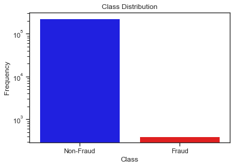
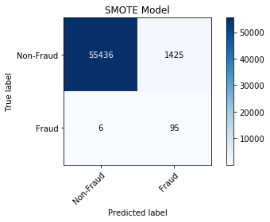
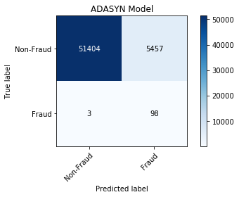

# Credit Card Fraud

## About
Can machine learning be used to detect credit card fraudulent activity? 

## Goal
Use the [recall](https://en.wikipedia.org/wiki/Precision_and_recall) metric to try to capture as many fraudulent activity as possible. While this will incur false-positives, the much smaller subset of accounts flagged as fraud can be audited to determine which ones are truly fraudulent.

## Data Set
The [Kaggle Credit Card Fraud Detection](https://www.kaggle.com/mlg-ulb/creditcardfraud) data set was used which has a heavily imbalanced class ratio between Fraud and Non-Fraud samples.

After splitting the data into train and test data sets, the train set imbalance was:

  
For confidentiality, PCA was used to create features V_1 - V_28. Unaltered features were:
- Time: seconds elapsed from start of data collection
- Amount: the transaction amount
- Class: Non-Fraud (0) and Fraud (1)

SMOTE and ADASYN oversampling techniques were used to create synthetic samples of fraud data.

## Results
Using a Logistic Regression model to predict the type of credit activity, I was able to achieve recall scores of 94.06% and 97.03% for SMOTE and ADASYN variants respectively. While the ADASYN model works better at capturing frauds, it comes at the price of roughly 4 times as many false-positives.

  

Therefore the best model depends on the cost of auditing vs the cost of leaving fraudulent activity unnoticed. Using the data from the above confusion matrices, the ADASYN model is more cost effective if the averge cost of an uncaught fraudulent account is 1345 times that of auditing.